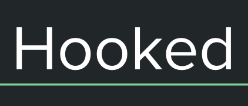

「このリポジトリは Code Chrysalis の生徒であるときに作成しました（This was created during my time as a student at Code Chrysalis）」

# Hooked

## navigation
1. [ABOUT](#ABOUT)
2. [LINK](#LINK)
3. [CREDITS](#CREDITS)
4. [CONTRIBUTING](#CONTRIBUTING)
## ABOUT
### これは洋楽に詳しくなりたい人やハマりたい人の為のアプリです! 
 
 
今現在人気のアーティストやアルバム、年代や国別の人気の曲などの幅広い分野を揃えています。 
これを使って海外の音楽への第一歩を踏み出しましょう(☝︎ ՞ਊ ՞)☝︎！
 
 
これはspotifyのAPIをメインで進めたプロジェクトです

## LINK
[Hooked](https://spotify-project-staging.herokuapp.com/)
## CREDITS
 
  
 

 
 

